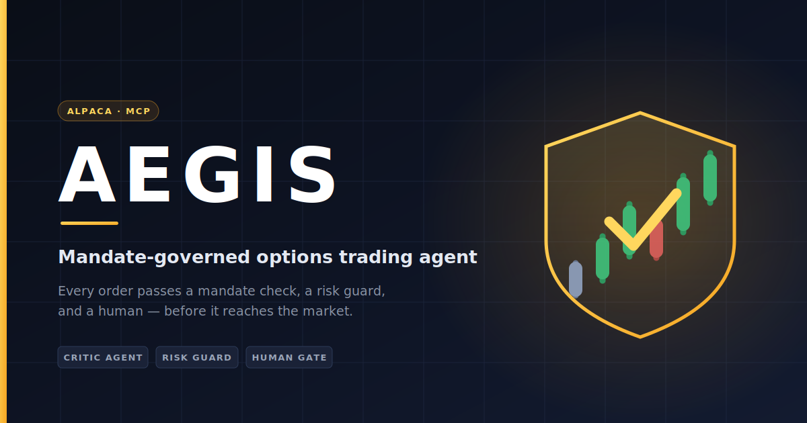
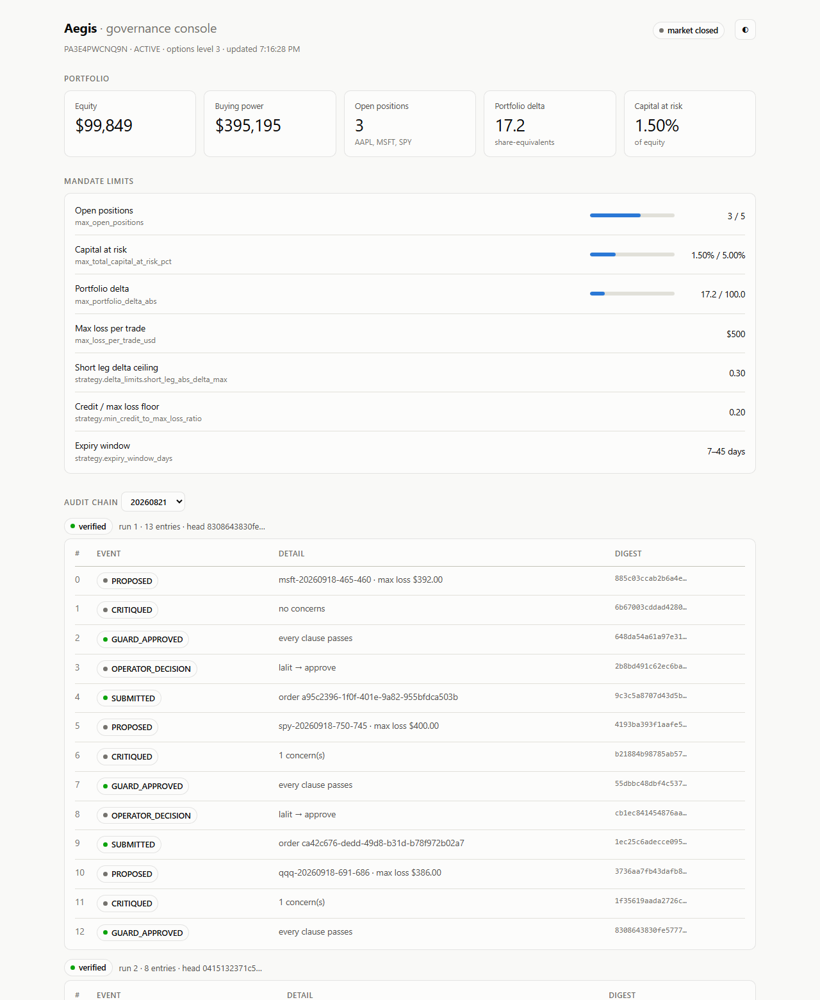

**Live console:** [aegis-ssnh.onrender.com](https://aegis-ssnh.onrender.com) — free tier, so the
first request after an idle period takes ~30s to wake.

# Aegis

A mandate-governed options trading agent, where the interesting engineering is in the refusals.

LLM agents are good at generating plausible trades and bad at refusing bad ones. A model asked
to propose a credit spread will produce something well-formed and confident every time, including
when the position is oversized, the strike is illiquid, or its own stated delta is wrong. Aegis
treats the model as an untrusted proposer: every claim it makes about a trade is re-derived or
re-observed before an order can reach the broker, and anything that cannot be checked is refused.

## The pipeline

`ExecutionGateway.submit()` is the only code path that can submit an order. Each gate re-checks
from scratch; nothing computed upstream is trusted.

```
                    proposal + portfolio source + approval token
                                      |
                                      v
                    +-------------------------------------+
                    |  mandate check                      |   pure, no network
                    |  universe, permitted structures     |   runs first: it is free
                    +-------------------------------------+
                                      |
                                      v
                    +-------------------------------------+
                    |  observation verifier               |   the only network hop
                    |  claimed delta vs live chain        |   in the pre-trade path
                    |  open interest >= mandate floor     |
                    |  strike listed, quote two-sided     |
                    +-------------------------------------+
                                      |
                                      v
                    +-------------------------------------+
                    |  risk guard                         |   pure, no network
                    |  re-run against a freshly fetched   |   deterministic arithmetic
                    |  PortfolioState, never a cached one |
                    +-------------------------------------+
                                      |
                                      v
                    +-------------------------------------+
                    |  approval token                     |
                    |  unexpired (120s TTL) and bound to  |
                    |  a hash of the proposal contents    |
                    +-------------------------------------+
                                      |
                                      v
                    +-------------------------------------+
                    |  broker: multi-leg limit order      |
                    |  alpaca-py, OrderClass.MLEG         |
                    +-------------------------------------+

   any gate fails --> write REJECTED to the audit chain --> raise GovernanceError
```

Nothing returns a sentinel a caller could ignore, and no refusal is raised before it is logged.

## Three ideas that make this different

**1. Max loss is derived from the strikes, not read from the proposal.**
A proposal states its own `max_loss_usd`. That is a claim. The OCC symbols in its legs
(`SPY260918P00753000`) encode the actual strikes, so `derive_max_loss()` computes the real
worst case for every permitted structure -- verticals from the width, iron condors from the
wider wing. Every dollar limit is then checked against `max(derived, claimed)`. Understating
risk buys nothing: a proposal claiming $50 of risk on a 20-point spread is refused twice, once
for the disagreement and once on the real $1,890.

**2. On a discrepancy the verifier refuses; it does not substitute.**
When an agent claims a 0.10-delta short leg and the chain shows 0.45, the tempting move is to
correct the number and carry on. Aegis refuses instead. Quiet correction produces an audit trail
of clean submissions while an agent misreports its inputs indefinitely -- the failure becomes
invisible exactly where it most needs to be visible. The observed values are returned in the
result so an operator can see the truth and re-propose against it, but that is a new proposal,
with a new hash, requiring new human approval.

**3. Anything unverifiable is a refusal.**
A mandate with no `risk_limits` section refuses everything. So does a structure whose max loss
cannot be derived, a leg with no delta, a chain with no open interest, a gateway constructed
without a verifier, and a guard with no market-session source. The rule is that a limit which
could not be checked has not been satisfied. Fail-open is never the default anywhere in the
pre-trade path.

## Quick start

```bash
git clone <repo-url> && cd aegis
python -m venv .venv && source .venv/bin/activate
pip install -r requirements.txt
cp .env.example .env      # then add paper keys from alpaca.markets
```

The demo runs offline -- the chain and the broker are stubbed, so no keys and no network are
needed. Everything else is the real code.

```bash
python demo.py
```

It walks five cases: a compliant proposal that reaches the broker, an agent understating its
delta, an illiquid strike, an oversized position, and a stale approval token. Four of the five
are refused.

```bash
pytest -q
```

With paper keys in `.env`, the whole thing runs against Alpaca:

```bash
python run_live.py --symbols SPY QQQ NVDA
```

For each symbol it fetches live state, proposes a spread, has the critic argue with it, prints
every mandate clause with the verdict, and then **stops and asks a human**. There is no `--yes`
flag: `skip` is the default on the decision prompt and submitting needs a second confirmation.
The option chain on its own is also runnable — `python -m aegis.core.option_chain SPY --dte 30`.

## Console

Deployed at **[aegis-ssnh.onrender.com](https://aegis-ssnh.onrender.com)** (free tier, ~30s cold
start). That instance runs with no broker or LLM credentials at all and replays a committed,
sanitised audit trail — `docs/sample-decisions.jsonl` — so the portfolio panel reports itself
unconfigured while the mandate and the chain render normally. To run it against your own logs:

```bash
python -m aegis.web        # http://127.0.0.1:8000
```



A read-only view of what the operator is being asked to trust: the account the mandate is
measured against, each limit with its current utilisation, and the day's audit chains with
verification **recomputed on read** rather than taken from the file. Edit a payload on disk and
the console says the chain is broken.

It is read-only on purpose. `ExecutionGateway` being the only path to the broker is a claim the
rest of the system rests on, so there is no approval endpoint here — a test asserts the app
exposes no verb but `GET` and `HEAD`. Approving a trade stays in the terminal, where the human
gate already lives.

## Testing

244 tests, all passing, no network calls -- the trading client, the chain fetcher, the market
session and both LLM backends are stubbed everywhere.

Passing tests are weak evidence on their own: they show the code does something, not that the
gates are load-bearing. So every gate has been mutation tested -- disabled one at a time, suite
re-run: the content-hash check, the guard re-evaluation, the expiry check, the conservative
`max(derived, claimed)`, the short-leg delta ceiling, the buying-power buffer, the open-interest
floor, the Eastern-time localization of calendar data, the ratio preference, the retry
predicate, the strike band, and others. Almost all are caught immediately by the test written
for them.

**Six survived over the life of the project, and every one exposed a defect in the test rather
than in the code:**

| Mutation that survived | What the test was actually doing |
| --- | --- |
| Gateway's "no verifier configured" refusal removed | `None.verify()` raised `AttributeError`, which the generic handler turned into the same `VerificationFailed` — right outcome, by accident |
| Default Gemini model flipped to one the account cannot use | nothing pinned the constant |
| Environment made to beat an explicit `model=` | the precedence test only exercised the dict-env path, never `os.environ` |
| `llm` dropped from `render_proposal(proposal, llm)` in `main()` | the render tests called the function directly; nothing checked the wiring |
| Root log level silenced to `ERROR` | the test asserted through `caplog`, which sets the root level itself and could never observe it |
| Gemini's `UNAVAILABLE` status-string fallback deleted | every test exception also carried a numeric code, so the branch was never the deciding factor |

Each is now pinned. That is the argument for the practice: a green suite told us nothing six
times, and only breaking the code on purpose said so.

## Stack

Python 3.14, [alpaca-py](https://github.com/alpacahq/alpaca-py) 0.44 for market data and order
submission, pytest for tests, and FastAPI serving one static page for the console. No database;
the mandate is a YAML file and the audit chain is an append-only JSONL log behind an injected
interface.

The language model is a configuration choice, not a dependency. `aegis/agents/llm.py` defines a
one-method `LLMClient` protocol — `complete(system, user)` — with backends for Gemini
(`gemini-3.6-flash`, the default when `GEMINI_API_KEY` is set) and Claude (`ANTHROPIC_API_KEY`,
which takes precedence). Model ids are the part that rots — providers deprecate on their own
schedule — so both read from the environment (`GEMINI_MODEL`, `ANTHROPIC_MODEL`) and a successor
model is a config change rather than an edit. Set neither and the agents run without a model: proposals carry no
thesis, the critic fails closed, and the trade is byte-identical. Keeping the protocol to one
method is what makes that swap cheap — and it also means nothing an agent cannot express through
`complete()` can be delegated to a model.

Market data is read through Alpaca's MCP server (`.mcp.json`), which is convenient for
exploration and for the agent's own research. Order flow does not go through it. Every order is
built and submitted by `ExecutionGateway` using alpaca-py directly, and the MCP server's
order-placing tools are deny-listed in `.claude/settings.local.json` so that path cannot be
taken by accident. Read market data through anything; write through one gate.

## Layout

| Path | Contents |
| --- | --- |
| `aegis/core/gateway.py` | `ExecutionGateway`, the only order path; `GovernanceError` hierarchy |
| `aegis/core/verifier.py` | reconciles agent claims against the observed chain |
| `aegis/core/risk.py` | deterministic enforcement of the mandate's numeric limits |
| `aegis/core/approval.py` | time-boxed approval tokens bound to proposal hashes |
| `aegis/core/proposal.py` | content-addressable proposals, OCC symbol parsing |
| `aegis/core/session.py` | market session state from Alpaca's clock and calendar |
| `aegis/core/option_chain.py` | option chain retrieval, joined across two Alpaca endpoints |
| `aegis/core/retry.py` | shared definition of which failures are worth retrying |
| `aegis/core/audit.py` | hash-chained decision log; `read_runs()` verifies on read |
| `aegis/core/portfolio.py` | live portfolio state, and the gateway's `PortfolioSource` |
| `aegis/agents/research.py` | proposes trades; the code decides, the model only explains |
| `aegis/agents/critic.py` | argues against a proposal; cannot approve one |
| `aegis/agents/llm.py` | one-method `LLMClient` protocol, Gemini and Claude backends |
| `aegis/web/app.py` | the read-only console |
| `run_live.py` | the operator's terminal: propose, critique, verdict, human gate |
| `demo.py` | the same pipeline offline, with the chain and broker stubbed |
| `config/mandate.yaml` | the limits every gate enforces |

## Known gaps

- Approval tokens are tamper-evident against proposal edits, not against forgery. Anything that
  can construct an `ApprovalToken` can authorise a trade; an HMAC over the fields is the fix if
  operators are not trusted.
- Quotes default to Alpaca's `indicative` feed, which needs no OPRA entitlement but is a
  synthetic NBBO with computed greeks. That assumption is a visible parameter rather than a
  silent one: `FEED_PRECISION` maps each feed to the delta tolerance it earns (indicative 0.05,
  OPRA 0.02) and the verifier reads its tolerance from the feed the chain actually came back on.
  Signing the OPRA agreement and passing `feed="opra"` tightens the check automatically. The
  tolerance still bounds how small a misreport the verifier can catch — it will spot a 0.10
  claimed against an observed 0.45, not a two-cent shading.
- The mandate prohibits opening within 7 days of earnings. Nothing enforces it; that needs a
  corporate-actions feed.
- The audit chain is tamper-*evident*, not tamper-proof. Anyone who can rewrite the log can also
  recompute it; anchoring the head hash somewhere the writer does not control is what would
  close that.
- The console has been rendered and checked in both themes, but headless Chrome here refuses a
  viewport below ~497px, so phone widths are unverified.
